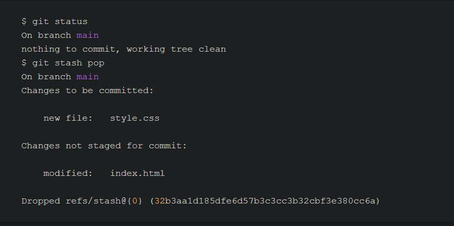
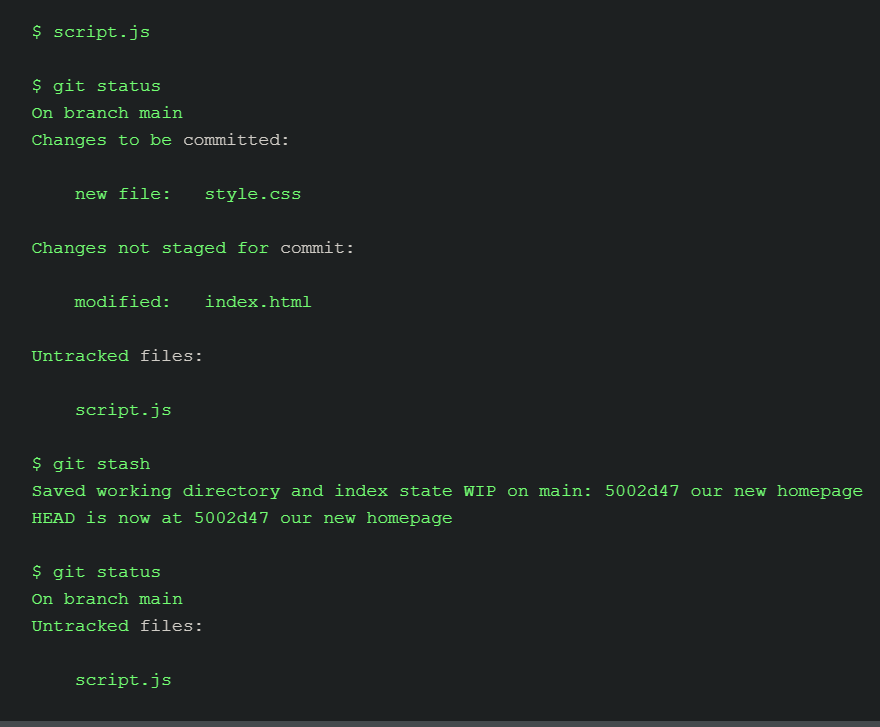
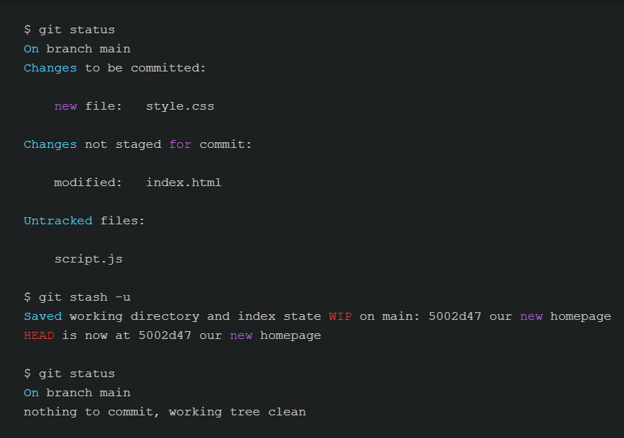
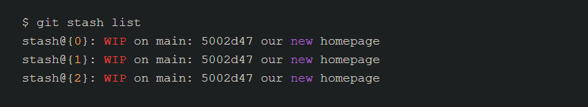
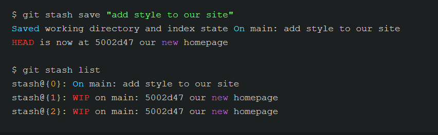
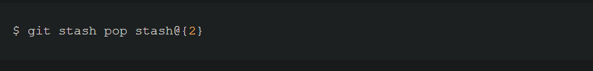
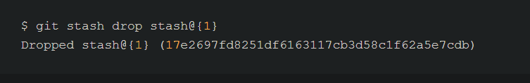
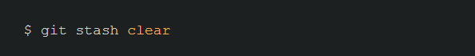

## Git Stash
`git stash` temporarily shelves (or stashes) changes you've made to your working copy so you can work on something else, and then come back and re-apply them later on. Stashing is handy if you need to quickly switch context and work on something else, but you're mid-way through a code change and aren't quite ready to commit.

<br />

### Stashing your work
The git stash command takes your uncommitted changes (both staged and unstaged), saves them away for later use, and then reverts them from your working copy. For example:


### Note:
At this point you're free to make changes, create new commits, switch branches, and perform any other Git operations; then come back and re-apply your stash when you're ready.

Note that the stash is local to your Git repository; stashes are not transferred to the server when you push.

<br />

### Re-applying your stashed changes
You can reapply previously stashed changes with `git stash pop`:



Popping your stash removes the changes from your stash and reapplies them to your working copy.

Alternatively, you can reapply the changes to your working copy and keep them in your stash with `git stash apply`:


This is useful if you want to apply the same stashed changes to multiple branches.

Now that you know the basics of stashing, there is one caveat with git stash you need to be aware of: by default Git won't stash changes made to untracked or ignored files.

# Stashing untracked or ignored files

By default, running git stash will stash:
1. changes that have been added to your index (staged changes)
2. changes made to files that are currently tracked by Git (unstaged changes)

But it will not stash:
1. new files in your working copy that have not yet been staged
2. files that have been ignored

```
So if we add a third file to our example above, but don't stage it (i.e. we don't run git add), git stash won't stash it.
```



<br />

#### Note: 
Adding the `-u` option (or --include-untracked) tells git stash to `also stash your untracked files`:



#### Note:

You can `include changes to ignored files` as well by passing the `-a` option (or --all) when running git stash.

<br />

### Managing multiple stashes
1. You aren't limited to a single stash. You can run git stash several times to create multiple stashes, 
2. `git stash list` to view them. 



3. To provide a bit more context, it's good practice to annotate your stashes with a description, using `git stash save "message"`:



4. By default, git stash pop will re-apply the most recently created stash: stash@{0} .... 
You can choose which stash to re-apply by passing its identifier as the last argument, for example:



<br />

### Cleaning up your stash
If you decide you no longer need a particular stash, you can delete it with git stash drop:



Or you can delete all of your stashes with:

